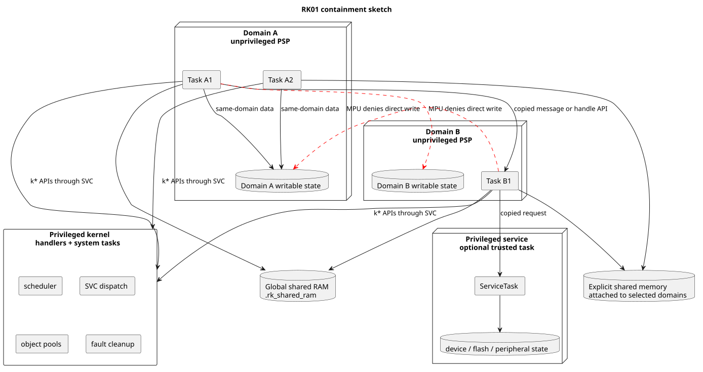
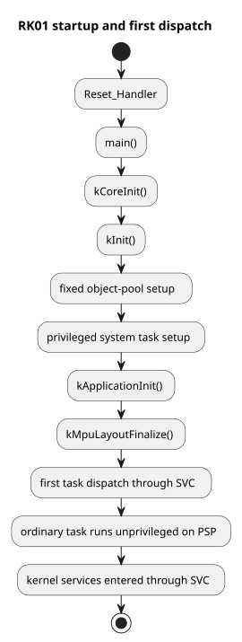
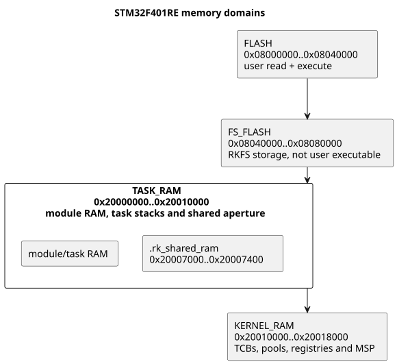
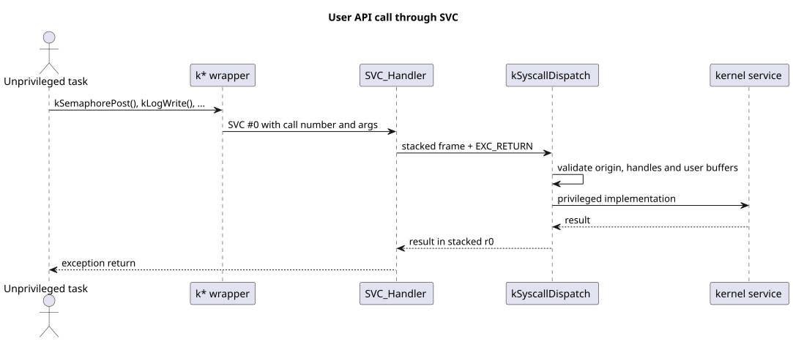
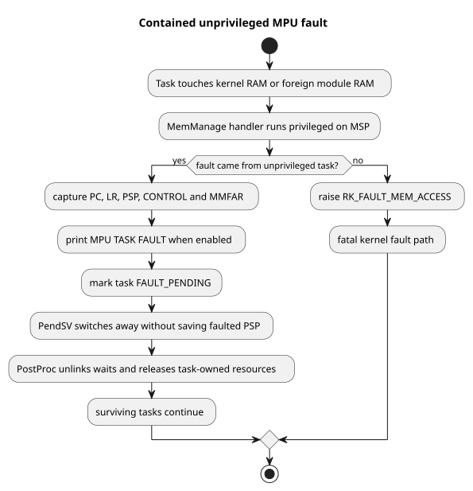

# RK01

RK01 is the RK0 kernel line with a Cortex-M MPU and an explicit kernel/user
boundary.

RK0 remains the mature flat real-time executive. It has the broader wiki and
DocBook material, and it is still the simpler choice when all firmware code is
trusted and shared memory is intentional. RK01 keeps the RK0 real-time model,
but changes what happens when ordinary task code is wrong: task code runs
unprivileged, kernel services are reached through SVC, and private task/module
RAM is enforced by the MPU.

This repository is the first public RK01 source drop. The README is deliberately
larger than the RK0 README because RK01 does not yet have the same external
manual/wiki set. Treat this as a working kernel snapshot, not a polished product
release.

Current version: 0.1.0.

## What RK01 Adds To RK0

RK01 is not a rewrite into a process operating system. It is still one
statically linked firmware image for a microcontroller. The kernel, startup
code, board port, privileged service tasks and build are trusted. Ordinary
application tasks are treated as possibly defective after dispatch.

Immediate differences from RK0:

| Area | RK0 | RK01 |
| --- | --- | --- |
| Firmware model | One trusted firmware image. | Still one firmware image. No hosted apps and no loader. |
| Kernel boundary | Kernel and application code share privileged address space. | Ordinary tasks run unprivileged on PSP and enter SVC for kernel services. |
| Memory protection | Cooperative discipline. | Cortex-M MPU regions protect kernel RAM, module RAM and shared apertures. |
| Application grouping | Tasks can directly share C globals. | Tasks share memory only inside their module, global shared RAM or explicit shared memory. |
| Kernel objects | Raw/static objects are natural; pool-backed creation is optional. | Runtime objects are fixed-capacity kernel pool entries addressed by opaque handles. |
| IPC rule | Pointer transfer is fine when firmware agrees. | By-reference direct messages are same-module only; cross-module data should be copied. |
| Bad syscall pointers | A bad pointer can become a privileged fault if unchecked. | SVC validates user read/write/function ranges before privileged code dereferences them. |
| Fault handling | Serious task faults usually become system faults. | Unprivileged MemManage faults can be contained, marked `FAULT_PENDING` and cleaned by PostProc. |
| Documentation state | Mature RK0 docs exist outside the source tree. | First public drop uses this README as the primary public guide. |

The short rule is: `RK0` is flat trusted real-time firmware; `RK01` is
RK0-style real-time firmware with MPU-backed containment.

## Architecture Sketch



## Containment Scope

RK01 targets embedded firmware that is still built as one statically linked
image, but needs MPU-backed damage containment after task dispatch. Its
protection boundary is practical and local:

- ordinary tasks run unprivileged and enter kernel services through SVC;
- kernel RAM, object pools, registries and privileged stacks remain
  privileged-only;
- each module gets an MPU-shaped private RAM domain for its tasks and stacks;
- cross-module data moves through copied IPC, global shared RAM or explicitly
  attached shared memory;
- unprivileged MemManage faults can be recorded, contained and cleaned up by
  PostProc.

The trusted base remains the kernel, startup code, board port, privileged
service tasks, build, DMA setup, debug access and physical device access. RK01
focuses on preventing defective unprivileged task code from corrupting kernel
RAM, another module's private RAM or privileged service state through ordinary
bad-pointer mistakes.

## Delivered Supported Targets

This repo delivers a build environment to run on Nucleo STM32F401RE M4F, and a QEMU environment for MPS2 Cortex-M33. RK01 does not use the _Trusted Environment_ from ARMv8M but this was the QEMU system of choice, and a means to test portability to _ARMv8M_.

| Target | Role | Status |
| --- | --- | --- |
| `ARCH=armv7m PLATFORM=stm32f401re` | STM32F401RE board path. | Main hardware path for timing, UART, flash and MPU behaviour. |
| `ARCH=armv8m PLATFORM=mps2-an505` | QEMU MPS2 AN505 Cortex-M33. | Fast functional smoke path for SVC and MPU mechanics. |

RK01 does not currently ship an ARMv6-M port. A future Cortex-M0+ MPU board can
still be useful, but it should be treated as a smaller single-module profile,
not as proof that multi-module isolation is practical on every MCU.

## Repository Layout

| Path | Purpose |
| --- | --- |
| `Makefile` | Firmware build, flash and run entry point. |
| `app/src/application.c` | Default public record-console example. |
| `app/examples/` | Selectable `APP_EXAMPLE` profiles. |
| `app/linker-modules.ld` | Module placement include used by the linker scripts. |
| `arch/armv7m/` | STM32F401RE Cortex-M4 port. |
| `arch/armv8m/` | MPS2 AN505 Cortex-M33 port. |
| `core/inc/` | Public and internal kernel headers. |
| `core/src/` | Scheduler, syscalls, objects, IPC and fault handling. |
| `middleware/inc/rkfs.h` | RKFS public interface. |
| `middleware/src/rkfs.c` | RKFS facade over LittleFS on F401. |
| `middleware/littlefs/` | Vendored LittleFS source subset. |
| `tools/board_harness.sh` | Build, flash and serial capture helper. |

The public repo intentionally leaves out local build products, board logs,
private harnesses, scratch scripts, `.DS_Store`, stack-usage files and personal
IDE settings.

## Build Requirements

- Different from RK0 that convervatively keeps aligned to C99 standard, RK01 requires a C11 compiler. 

Required for firmware builds:

- GNU Make
- `arm-none-eabi-gcc`
- `arm-none-eabi-objcopy`
- `arm-none-eabi-size`

Optional:

- `qemu-system-arm` for the Cortex-M33 smoke target
- OpenOCD, `st-flash`, STM32 Programmer CLI or J-Link for STM32F401RE flashing
- a serial terminal, or `make board-run`, for board UART output

The Makefile defaults are `ARCH=armv7m`, `PLATFORM=stm32f401re`,
`APP_EXAMPLE=tiny`, `TARGET=rk01_demo` and `FPU=OFF`.

## Quick Start

Build the default STM32F401RE image:

```sh
make -j4 ARCH=armv7m PLATFORM=stm32f401re
```

Build with the F401 M4F hard-float ABI:

```sh
make -j4 ARCH=armv7m PLATFORM=stm32f401re FPU=ON
```

Build the Cortex-M33 QEMU image:

```sh
make -j4 ARCH=armv8m PLATFORM=mps2-an505
```

Run the QEMU M33 smoke target:

```sh
make qemu-m33
```

Build with source-stepping-friendly optimisation:

```sh
make -j4 ARCH=armv7m PLATFORM=stm32f401re OPT=-Og
make -j4 ARCH=armv8m PLATFORM=mps2-an505 OPT=-Og
```

## Default Application

The default `APP_EXAMPLE=tiny` application is a small record console.

On STM32F401RE:

- USART2 on PA2/PA3 receives terminal input.
- A privileged console driver task owns UART RX/TX for normal console traffic.
- Ordinary task writes enter SVC and synchronously call that UART service; the
  service executes the transaction at the caller's effective priority for the
  extended call/reply rendezvous.
- UART RX is interrupt-driven and delivered by the service to the current
  foreground RX owner.
- The foreground app console accepts CR, LF and CRLF endings.
- Completed input lines are stored in a shared line ring, up to
  `RK_CONF_CONSOLE_LINE_MAX_BYTES` bytes.
- `EchoTask` runs unprivileged in an explicit `Echo` module.
- `EchoTask` parses commands such as `SET A 123` and `READ A`.
- In the default mixed console, SysMon diagnostics are routed explicitly with
  `RKMONITOR <command>`, for example `RKMONITOR ps`.
- `RecordTask` runs unprivileged in an explicit `Rec` module.
- Echo calls Record through copied call/reply messages.
- A privileged `FS` service task owns RKFS/LittleFS, reserved flash and the
  STM32 flash controller.
- Record slots are persisted in the reserved `FS_FLASH` region.

Expected board banner:

> `RK01 USART2 record console ready. SET A 123, READ A, RKMONITOR help.`
> `Record slots: 4, persisted in flash through rkfs.`

Try `SET A 123`, `READ A`, `SET B 77`, `READ B` and `RKMONITOR ps`.

The same application shape builds for the MPS2 AN505 target, but without
STM32F401RE flash persistence.

## Example Profiles

Select examples with `APP_EXAMPLE`:

```sh
make -j4 APP_EXAMPLE=01-fleet
make -j4 APP_EXAMPLE=02-isolated
make -j4 APP_EXAMPLE=03-watchdog
make -j4 APP_EXAMPLE=04-sysmon
make -j4 APP_EXAMPLE=99-showcase
```

| Example | Focus |
| --- | --- |
| `tiny` | Record console, Echo/Record modules, copied call/reply, RKFS on F401. |
| `01-fleet` | Explicit Control/Comms modules and copied task-addressed IPC. |
| `02-isolated` | Isolated one-task modules exchanging copied messages. |
| `03-watchdog` | STM32F401RE watchdog through the HAL, or a heartbeat task on targets without one. |
| `04-sysmon` | Optional SysMon kernel diagnostic service. |
| `99-showcase` | Larger combined example with App tasks, isolated tasks, explicit modules and copied IPC. |

## Flashing And Board Capture

Flash with the selected tool:

```sh
make flash ARCH=armv7m PLATFORM=stm32f401re FLASH_TOOL=openocd
make flash ARCH=armv7m PLATFORM=stm32f401re FLASH_TOOL=st-flash
make flash ARCH=armv7m PLATFORM=stm32f401re FLASH_TOOL=stm32programmer
make flash ARCH=armv7m PLATFORM=stm32f401re FLASH_TOOL=jlink
```

Run the board harness:

```shgit
make board-run SERIAL_PORT=/dev/cu.usbmodemXXXX
make board-run BOARD_TIMEOUT=10
make board-run BOARD_FLASH_TOOL=jlink SERIAL_PORT=/dev/cu.usbmodemXXXX
```

The harness builds, flashes, resets and captures a bounded UART log into
`build-board/logs/`.

## Execution Model

Startup remains simple: `Reset_Handler` enters `main()`, which calls
`kCoreInit()` and then `kInit()`. Kernel init sets up fixed object pools,
privileged system tasks, application BOOT construction, MPU layout finalisation
and the first task dispatch. Ordinary task code then runs unprivileged and uses
SVC for kernel services.



Handlers run privileged on MSP. Ordinary tasks run on PSP and normally run
unprivileged. Privileged system tasks also use PSP, but keep privileged CONTROL
state.

## Memory Model

RK01 separates memory by privilege first and by module ownership second.



| Region | Access |
| --- | --- |
| Flash | User-readable and executable. On STM32F401RE this is `0x08000000..0x08040000`. |
| FS_FLASH | STM32F401RE reserved flash at `0x08040000..0x08080000`, used by RKFS. Not user executable. |
| Task/module RAM | Writable only by tasks whose current MPU view maps that module. |
| Global shared RAM | Small firmware-wide aperture mapped into ordinary tasks. |
| Explicit shared memory | Boot-created shared segment attached only to selected modules. |
| Kernel RAM | Privileged only. Contains TCBs, object pools, registries and privileged stacks. |

Typical MPU slot intent:

| MPU slot | Meaning |
| --- | --- |
| Region 0 | User-readable executable Flash, installed once. |
| Region 1 | Active task/module RAM, rewritten on context switch. |
| Region 2 | Global shared RAM, rewritten from the incoming TCB. |
| Regions 3..7 | Explicit shared-memory segments, enabled only when attached. |

Privileged handler code keeps the default memory map through `PRIVDEFENA`.
Unprivileged task code only sees the programmed user regions.

## Modules

A module is an MPU-shaped RAM domain shared by a set of tasks. It is not a
process. It has no executable image, user, file table or scheduler namespace.

The normal small-application shape is still RK0-like:

```c
RK_DECLARE_TASK(workerHandle, WorkerTask, workerStack, 256U)

kTaskInit(&workerHandle, WorkerTask, RK_NO_ARGS, "Worker",
          workerStack, 256U, WORKER_PRIO, RK_PREEMPT);
```

That places the task in the implicit `App` module. Tasks in the same module can
share module RAM directly and should protect shared mutable state with ordinary
RK0-style services such as mutexes or semaphores.

Use explicit modules only when there is a real fault-containment boundary:

```c
RK_DECLARE_MODULE(controlModule, controlRam, 4096U)
RK_DECLARE_MODULE_TASK(controlHandle, ControlTask)

kModuleInit(&controlModule, controlRam, sizeof(controlRam), "Control");
kModuleTaskInit(&controlModule, &controlHandle, ControlTask, RK_NO_ARGS,
                "Control", 256U, CONTROL_PRIO, RK_PREEMPT);
```

Cross-module payload transfer should normally use copied IPC.

## Syscalls And Handles

Public `k*` APIs are callable from privileged BOOT code and from unprivileged
task code. When the caller is unprivileged, wrappers enter SVC and the
dispatcher validates:

- syscall number and trap origin;
- handles and object type/generation state;
- user input buffer readability;
- user output buffer writability;
- callback/function pointer validity;
- packed argument structs before nested pointer use.



Runtime kernel objects are fixed-capacity pool entries. Application code keeps
opaque handles, not pointers to kernel control blocks:

```c
RK_DECLARE_LOCAL_SEMAPHORE(readySema)

kSemaphoreCreate(&readySema, 0U, 1U);
kSemaphorePost(readySema);
kSemaphorePend(readySema, RK_WAIT_FOREVER);
kSemaphoreDestroy(&readySema);
```

## Synchronisation And IPC Contracts

Start with the RK0 interaction, then apply the RK01 memory rule.

| Interaction | RK01 rule |
| --- | --- |
| Shared memory | Direct load/store is allowed only where the MPU maps the same RAM into the participating tasks. Use mutexes for shared-memory ownership. |
| Asynchronous direct message | Transfers message ownership. By-reference messages require memory both sides can access; copied async messages can cross non-shared module boundaries. Pool ceilings apply to this ownership contract. |
| Synchronous send/receive | Blocking copy rendezvous: the sender waits until the receiver copies the payload. There is no reply and no receiver priority substitution. |
| Synchronous call/reply | Extended rendezvous: the caller waits for a reply and the server runs at caller effective priority while the call is queued or active. Syscall validation lets copied payloads cross non-shared module boundaries. |
| Cross-module notification | Task events or copied messages. |
| Cross-module payload | Message queues, mailboxes, synchronous send/receive, synchronous call/reply or task-addressed copy messages. |
| Latest value | MRM is module-local because leases are pointers. Use copied payloads or a small `RK_SHARED_MEM` snapshot across modules. |

RK01 deliberately keeps both shared-state services and message-passing services.
It does not force every local interaction into an actor model.

## Fault Diagnostics

MemManage faults are used to contain unprivileged MPU violations. When fault
printing is enabled, RK01 prints the first cause directly, for example:

> `MPU TASK FAULT: data access violation task=Echo tid=4 pc=0x08001234 lr=0x08005678 addr=0x20010000 cfsr=0x00000082 mmfsr=0x82 frame=1`



Fatal privileged/kernel memory faults report `RK_FAULT_MEM_ACCESS`. Contained
task faults are normally marked for cleanup; enabling
`RK_CONF_MPU_TASK_FAULT_FAIL_FAST` turns that into a first-fault halt for
debugging.

## Public API Headers

Use the narrowest public header that fits the code:

| Header | Use |
| --- | --- |
| `kapi_app.h` | Ordinary App tasks, local objects, copied IPC, timers, sleep and logging. |
| `kapi_module.h` | BOOT code that declares explicit modules, isolated tasks or shared memory. |
| `kconsole.h` | Privileged console UART service, foreground RX ownership and bounded console writes. |
| `kapi_diag.h` | Optional diagnostics such as SysMon object naming and trace snapshots. |
| `kapi_trusted.h` | Privileged service setup and low-level trusted construction. |
| `kapi.h` | Compatibility umbrella. |

## Current Limits

This public drop is useful for source review, experimentation and early board
testing, but several areas still need release hardening:

- generated configuration-specific memory maps;
- a maintained public board-regression suite;
- richer supervisor fault records;
- measured SVC, PRIMASK, SysTick and PendSV budgets on hardware;
- a final decision on which historical transition notes should become public
  documentation;
- broader target qualification.

For now, use RK0 when you need the mature flat kernel documentation and RK01
when you specifically want the MPU/SVC containment model.

## License

RK01 source files use the Apache-2.0 SPDX identifier. See `LICENSE`.

The `middleware/littlefs` subset is the upstream LittleFS code used by RKFS and
keeps its own licence file in `middleware/littlefs/LICENSE.md`.
