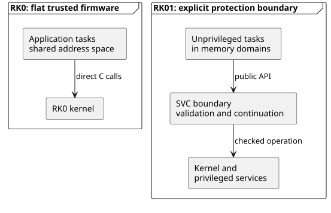
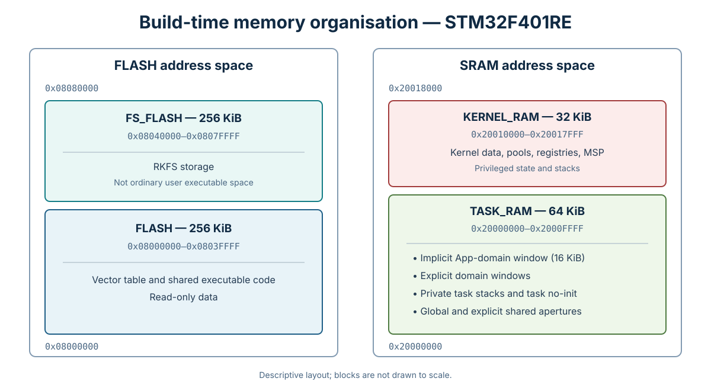
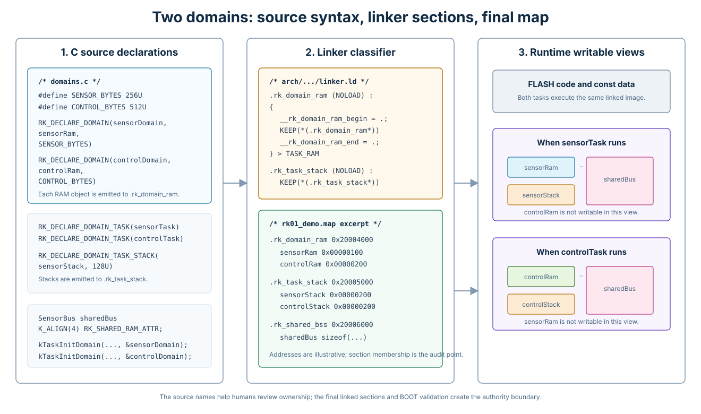
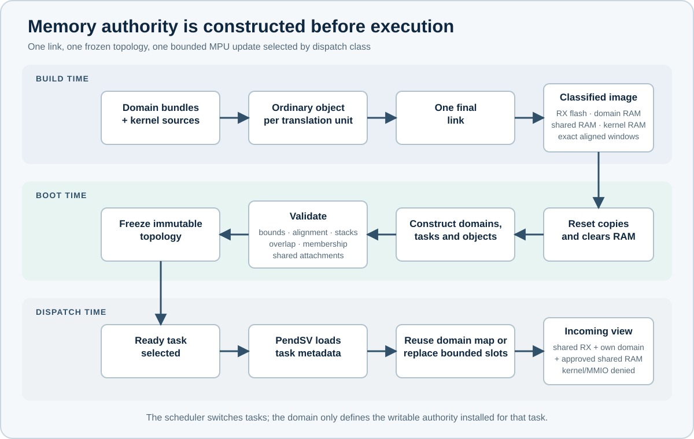
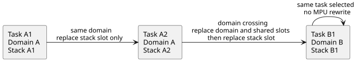
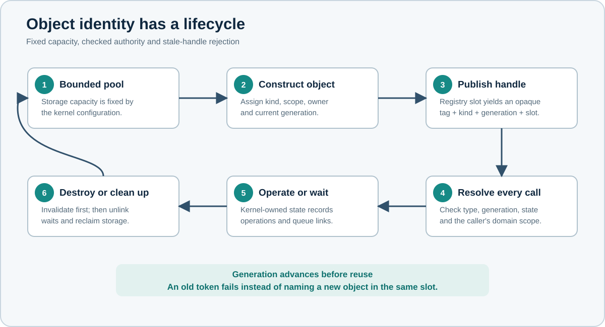
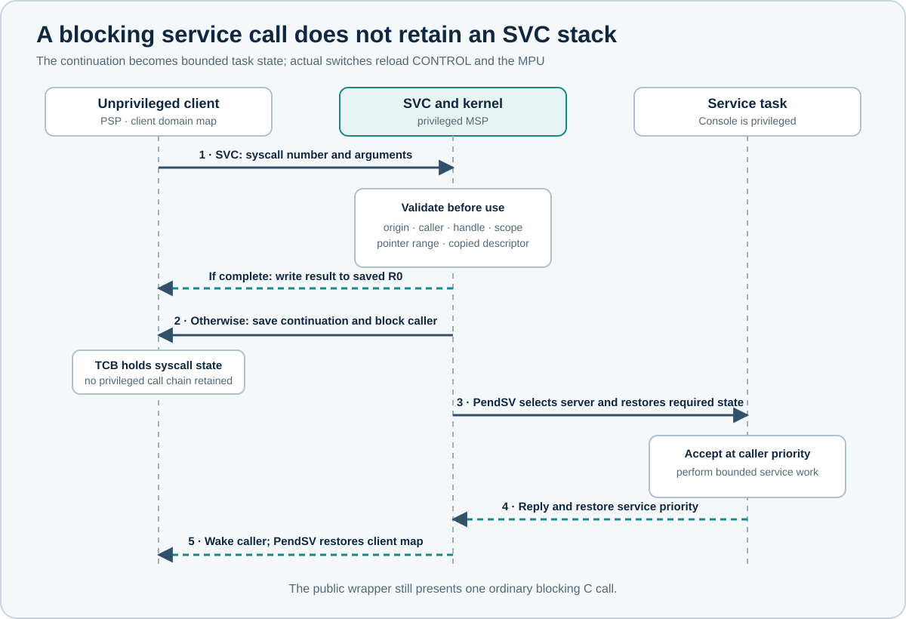
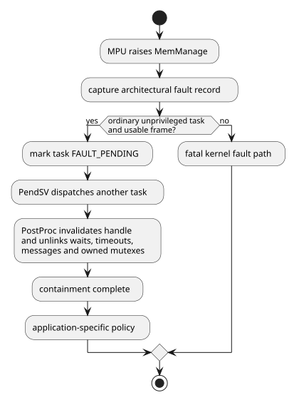
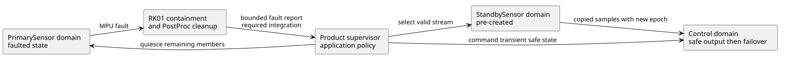
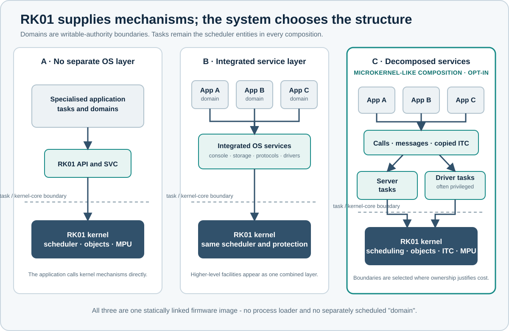

# RK01 Architectire Specification Document

### Acronyms and working terms

| Acronym / term     | Meaning in this document                                             |
|:-------------------|:---------------------------------------------------------------------|
| API                | Application programming interface                                    |
| BOOT               | Privileged system-construction phase before the scheduler starts     |
| DMA                | Direct memory access                                                 |
| FPU                | Floating-point unit                                                  |
| ISR                | Interrupt service routine                                            |
| ITC                | Inter-task communication                                             |
| MMIO               | Memory-mapped input/output                                           |
| MPU                | Memory protection unit                                               |
| MSP                | Main stack pointer, used by privileged exception execution           |
| PSP                | Process stack pointer, used by task execution                        |
| SVC                | Supervisor call exception and the RK01 checked service-entry path    |
| TCB                | Task control block                                                   |
| TCB continuation   | Bounded state stored in a TCB to resume a blocking syscall           |
| TCB trust boundary | Kernel ownership of task identity, state and saved execution context |
| TCB registry       | Kernel table used to resolve an opaque task handle                   |
| WCET               | Worst-case execution time                                            |


| Term                   | Meaning
|:-----------------------|:---------------------------------------------------------------------------------------------------------------------------------------------|
| Task                   | The independently scheduled entity.                                                                                                          |
| Domain                 | One validated writable-memory map shared by one or more tasks.                                                                               |
| Implicit App domain    | Default domain for tasks created through the RK0-like application path.                                                                      |
| Explicit domain        | A named BOOT-created domain with declared RAM, members and optional shared attachments.                                                      |
| One-task domain        | A normal domain with one member task. It is not a separate scheduler type.                                                                   |
| Privileged system task | A task deliberately run with privileged CONTROL state. It remains trusted.                                                                   |
| Domain source bundle   | A C source-organisation convention for declarations, private state, BOOT construction and task sources. It is not a separately linked image. |
| Writable authority     | The RAM and MMIO that the currently selected task is permitted to modify.                                                                    |


## Requirements and Impact

### Required system invariants

| ID            | Requirement                                                                                                                        | Verification                                  |
|:--------------|:-----------------------------------------------------------------------------------------------------------------------------------|:----------------------------------------------|
| **`SYS-001`** | RK01 shall schedule tasks using fixed-priority preemptive scheduling.                                                              | Scheduler regression and priority-order tests |
| **`SYS-002`** | A domain shall define writable-memory access only. It shall not have a priority, execution context, CPU budget or scheduler state. | TCB/domain data-structure review              |
| **`SYS-003`** | Each task shall retain its own context, priority, state, timeout links and private stack.                                          | Context-switch and task-state tests           |
| **`SYS-004`** | Task, object, queue and message capacities shall remain bounded by build configuration.                                            | Configuration and pool-exhaustion tests       |
| **`SYS-005`** | RK01 shall produce one statically linked firmware image. Run-time code loading and domain relocation are outside the design.       | Build artifact and linker-map review          |
| **`SYS-006`** | The writable-memory topology shall be validated and frozen before the first application dispatch.                                  | BOOT negative tests and late-change rejection |


### RK0 to RK01 impact matrix

| Area           | RK0                                                      | RK01 change                                                                             | Required development action                                                                          |
|:---------------|:---------------------------------------------------------|:----------------------------------------------------------------------------------------|:-----------------------------------------------------------------------------------------------------|
| Trust          | Application and kernel share privileged write access.    | Ordinary tasks run unprivileged; kernel, handlers and selected services remain trusted. | Review every privileged task and callback. Keep privileged code explicit and small.                  |
| Scheduling     | Fixed-priority tasks.                                    | Preserved. Domains are not scheduled.                                                   | Retain task-level response-time analysis and add boundary costs per path.                            |
| Memory         | Application and kernel writable data share one flat map. | Linker separates task RAM, kernel RAM, domain RAM, stacks and shared apertures.         | Classify every writable symbol and review the final map file.                                        |
| Build          | Ordinary objects feed one final link.                    | Still one final link; section placement now defines write access.                       | Keep domain source bundles auditable and ensure linker, BOOT and configuration agree.                |
| BOOT           | Creates kernel/application state.                        | Also validates and freezes the domain topology.                                         | Add negative tests for alignment, bounds, overlap, membership and late mutation.                     |
| Dispatch       | Saves/restores registers.                                | Also maintains the active MPU view.                                                     | Measure no-update, stack-only and full-map paths separately.                                         |
| API entry      | Direct C call.                                           | Unprivileged task calls cross SVC; allowed privileged calls stay direct.                | Define an SVC number, argument format, validation and completion path for every task-facing service. |
| Blocking calls | A kernel call may block in the flat model.               | Blocking state is stored as a TCB continuation.                                         | Specify start, wait, wake, timeout, destroy, peer-fault and resume phases.                           |
| Identity       | Handles may be kernel pointers.                          | Handles are opaque generation-checked tokens.                                           | Use one publish/resolve/unpublish lifecycle for every object family.                                 |
| Scope          | A valid address is generally usable.                     | Handle validity and domain permission are separate checks.                              | Mark objects domain-local or intentionally kernel-global.                                            |
| ITC            | Application pointers are broadly meaningful.             | Cross-domain data must be copied or explicitly shared.                                  | State buffer ownership, lifetime and copy/reference rules in each protocol.                          |
| Priority       | Specialised RK0 protocols apply different rules.         | The rules cross the protection boundary unchanged in meaning.                           | Keep queued-send inheritance, accepted-call substitution and async ceilings separate.                |
| Faults         | A bad write can damage the whole image.                  | Eligible unprivileged faults can retire one task and clean kernel links.                | Define product supervision, domain quiescence, failover or reset.                                    |
| OS structure   | OS-like code shares the flat application space.          | Direct, integrated and service-oriented compositions are available.                     | Add service boundaries only where containment or ownership justifies their cost.                     |
| Timing         | Direct calls and one switch class dominate.              | SVC, continuations and two task-change MPU classes add paths.                           | Record the exact path class in every timing result and WCET budget.                                  |

<a id="fig:rk0-rk01-boundary"></a>



*Figure 1 — Required boundary change. Scheduling remains task-based; writable access becomes task-view based.*

### Protection assumptions and exclusions

RK01 assumes one intentionally built image. The build, linker, startup, board port, kernel, exception paths and deliberately privileged services are trusted. Ordinary task code may contain memory errors or be compromised through an application defect.

| RK01 shall contain or reject                    | RK01 does not claim to contain                          |
|:------------------------------------------------|:--------------------------------------------------------|
| Unprivileged writes to kernel RAM               | Malicious or defective privileged code                  |
| Unprivileged writes to another domain’s RAM     | Defective exception handlers or board-port code         |
| Writes to another task’s private stack          | Unrestricted DMA initiated by trusted code              |
| Unapproved direct MMIO access                   | Debug, physical access or a dishonest build             |
| Forged, stale or wrong-kind handles             | Arbitrary run-time code loading                         |
| Invalid caller buffers at SVC                   | Product-state corruption that occurred before the fault |
| Stale kernel wait/ownership links after cleanup | Automatic reconstruction of application invariants      |

### Implementation dependency chain


1.  Classify writable memory in the linker.

2.  Construct and validate domains, stacks and shared apertures during BOOT.

3.  Install the selected task’s MPU view at dispatch.

4.  Route unprivileged service calls through SVC.

5.  Resolve opaque handles and validate caller memory before use.

6.  Store blocking syscall state in the TCB and define every completion path.

7.  Apply ITC and priority rules that match the actual memory relationship.

8.  Clean all protocol links after eligible task faults.

9.  Measure each new run-time path separately.

Skipping a step either reopens the protection boundary or leaves an unbounded/undefined failure path.

## Domain, memory and build design


> The final linked section, not the source filename or object filename, decides which task may write a variable. Domain declarations, linker placement, reset initialisation and BOOT validation shall be reviewed as one implementation path.

### Domain and memory requirements

| ID            | Requirement                                                                                                                 | Owner / verification               |
|:--------------|:----------------------------------------------------------------------------------------------------------------------------|:-----------------------------------|
| **`DOM-001`** | Every ordinary task shall belong to exactly one domain before topology finalisation.                                        | BOOT / membership tests            |
| **`DOM-002`** | Tasks in one domain may share persistent domain RAM, but each task shall retain a separate private stack mapping.           | Kernel and port / fault injection  |
| **`DOM-003`** | A domain may contain one task. No special scheduler path shall be introduced for this topology.                             | Kernel / scheduler regression      |
| **`DOM-004`** | Domain membership shall be selected from required writable sharing and fault containment, not from source-directory layout. | Product / architecture review      |
| **`DOM-005`** | Shared RAM between domains shall be explicitly declared and attached before finalisation.                                   | BOOT / negative access tests       |
| **`DOM-006`** | Domain membership and shared attachments shall be immutable after finalisation.                                             | Kernel / late-change rejection     |
| **`MEM-001`** | The linker shall separate executable/read-only storage, task-writable RAM and kernel-only RAM.                              | Port / map-file review             |
| **`MEM-002`** | Domain state, private stacks and shared apertures shall use named sections with MPU-compatible size and alignment.          | Build and port / linker assertions |
| **`MEM-003`** | Reset startup shall copy or clear each classified section before BOOT reads it.                                             | Port / startup test                |
| **`MEM-004`** | BOOT shall reject out-of-range, overlapping, misaligned or invalidly sized regions.                                         | Kernel / negative tests            |
| **`MEM-005`** | The build shall report unexpected writable globals in domain implementation sources.                                        | Build / symbol audit               |
| **`MEM-006`** | The final link shall export the bounds required by startup, BOOT validation and diagnostics.                                | Port / symbol check                |

### One image, ordinary objects, one final link

RK01 does not produce several objects nor does it load independent application images at run time. Intermediate objects files are inputs to one final link.

The ARMv7-M linker script uses the following regions:

| Area       | Current STM32F401RE placement | Purpose                                                                                     |
|:-----------|:------------------------------|:--------------------------------------------------------------------------------------------|
| FLASH      | 256 KiB at `0x08000000`       | Shared executable code and read-only data.                                                  |
| FS_FLASH   | 256 KiB at `0x08040000`       | Reserved storage used by RKFS; not part of the ordinary executable user window.             |
| TASK_RAM   | 64 KiB at `0x20000000`        | Implicit App-domain RAM, explicit domain windows, private task stacks and shared apertures. |
| KERNEL_RAM | 32 KiB at `0x20010000`        | TCBs, object pools, registries, kernel data, privileged stacks and the MSP.                 |

<a id="fig:rk01-memory-map"></a>



*Figure 2 — STM32F401RE build-time memory organisation. Blocks are descriptive, not drawn to scale.*

The exact sizes are board-port choices, not universal RK01 constants. Every port shall preserve the separation, even when the addresses and capacities change.

Within TASK_RAM, the current ARMv7-M script reserves:

- an MPU-aligned 16 KiB window for the implicit App domain;

- a generic collection for explicit `.rk_domain_ram*` windows;

- a distinct `.rk_task_stack*` collection for ordinary private stacks;

- task no-init storage;

- a fixed 1 KiB global shared aperture;

- optional explicit shared regions declared by the application.

Kernel `.data`, `.bss`, no-init data, object pools and privileged stacks go to KERNEL_RAM. Shared code remains in FLASH. The linker therefore acts as the build-time classifier of writable access.

<a id="fig:rk01-two-domain-code-link-map"></a>



*Figure 2A - Two-domain source syntax beside the linker script and map-file view.*

For review, a two-domain design should be read in three columns:

1.  The source declaration states the intended ownership: domain windows, domain-member tasks, private stacks and deliberately shared RAM.

2.  The linker script classifies those objects into `.rk_domain_ram*`, `.rk_task_stack*` and `.rk_shared_bss*` inside TASK_RAM, then exports the bounds used by startup and MPU validation.

3.  The final map file proves where each symbol landed. Source filenames are useful for review, but section placement and BOOT validation define the writable authority boundary.

### Required domain source-bundle pattern

Expected developer view:

| File                  | Responsibility                                                                                       |
|:----------------------|:-----------------------------------------------------------------------------------------------------|
| `domain_a.h`          | Public request, reply and export types. It should not expose private writable representation.        |
| `domain_a_internal.h` | Typed private RAM layout, member-task declarations and implementation-only definitions.              |
| `domain_a.c`          | The domain window and descriptor, BOOT construction, public exports and composition of member tasks. |
| `domain_a_worker.c`   | One or more member-task implementations using the private typed RAM view.                            |


**Illustrative domain source bundle**

```
/* domain_a_internal.h */
RK_DECLARE_DOMAIN_RAM(DOMAIN_A_RAM,
    RK_DOMAIN_RAM_MEMBER(DOMAIN_A_CONFIG, config)
    RK_DOMAIN_RAM_MEMBER(DOMAIN_A_STATE, state)
    RK_DOMAIN_RAM_TASK_HANDLE(workerHandle)
    RK_DOMAIN_RAM_TASK_HANDLE(serverHandle)
)

/* domain_a.c */
RK_DECLARE_TYPED_DOMAIN(domainA, domainARam,
                        DOMAIN_A_RAM, DOMAIN_A_BYTES)
RK_DECLARE_DOMAIN_TASK_STACK(workerStack, WORKER_STACK_WORDS)
RK_DECLARE_DOMAIN_TASK_STACK(serverStack, SERVER_STACK_WORDS)

void DomainABoot(void)
{
    ram = RK_DOMAIN_STATE(domainARam);
    clear_domain_window(domainARam);
    require(RK_DOMAIN_INIT_TYPED(&domainA, domainARam, "A"));
    require(kTaskInitDomain(&ram->workerHandle, ..., &domainA));
    require(kTaskInitDomain(&ram->serverHandle, ..., &domainA));
    attach_required_shared_regions(&domainA);
}
```

The example shows ownership and ordering. The public header shall expose message and result types, not the private `DOMAIN_A_RAM` representation.

### Build and BOOT flow

<a id="fig:rk01-build-and-boot"></a>



*Figure 3 — Construction of writable authority across build, BOOT and dispatch.*

The implementation shall preserve this sequence:

1.  Declarations create intentionally named writable sections.

2.  Each source file is compiled normally.

3.  The final linker collects, aligns and bounds those sections and exports startup symbols.

4.  Reset startup copies initialised data and clears the appropriate zero-initialised areas.

5.  Privileged BOOT code initialises domains, allocates typed domain state, creates tasks and attaches explicit shared regions.

6.  Before scheduling begins, the kernel validates region size and alignment, TASK_RAM containment, non-overlap, private-stack placement, domain membership and shared mappings.

7.  The topology is frozen.

8.  PendSV dispatches tasks using precomputed MPU descriptors.

The kernel shall not discover or construct an address space inside every context switch. Dispatch consumes descriptors that BOOT already validated.

**Required BOOT finalisation order**

```
boot_finalize()
{
    require(scheduler_started == false);

    for each domain {
        require(mpu_size_and_alignment_valid(domain.ram));
        require(within_TASK_RAM(domain.ram));
        require(no_region_overlap(domain.ram));
        validate_shared_attachments(domain);
        precompute_immutable_mpu_map(domain);
    }

    for each ordinary_task {
        require(task.domain != NULL);
        require(private_stack_valid(task.stack));
        require(stack_not_shared_or_overlapping(task.stack));
    }

    freeze_domain_topology();
}
```


## Runtime protection and context-switch design

> PendSV shall install the memory view of the selected task before returning to unprivileged thread mode. The scheduler selects a task; the port derives the required MPU work from the selected task and its immutable domain map.

### MPU and dispatch requirements

| ID            | Requirement                                                                                                                  | Owner / verification                      |
|:--------------|:-----------------------------------------------------------------------------------------------------------------------------|:------------------------------------------|
| **`MPU-001`** | Shared user FLASH shall be executable and read-only to ordinary tasks and shall be installed as a fixed MPU role.            | Port / execute and write-fault tests      |
| **`MPU-002`** | An ordinary task view shall contain its domain RAM, its private stack and only the shared apertures attached to its domain.  | Kernel and port / access matrix           |
| **`MPU-003`** | Re-selecting the active task shall not rewrite the MPU.                                                                      | Port / cycle and register trace           |
| **`MPU-004`** | Switching to another task in the active domain shall replace only the private-stack slot.                                    | Port / same-domain profile                |
| **`MPU-005`** | Switching domains shall replace domain and shared slots, then install the incoming task’s private stack.                     | Port / inter-domain profile               |
| **`MPU-006`** | The port shall complete MPU programming and required architectural barriers before unprivileged execution resumes.           | Port / instruction review and fault tests |
| **`MPU-007`** | Privileged handlers and explicitly privileged tasks may use the privileged default map and shall be treated as trusted code. | Product and port / privilege review       |

### MPU region roles

The current ARMv7-M port assigns fixed roles to the MPU regions:

| Region | Authority                                             | Update rule                                                    |
|:-------|:------------------------------------------------------|:---------------------------------------------------------------|
| 0      | Shared user FLASH, executable and read-only           | Installed once during MPU initialisation.                      |
| 1      | Active domain RAM                                     | Replaced when dispatch crosses a domain boundary.              |
| 2      | Active task’s private stack                           | Replaced on every dispatch to a different task.                |
| 3      | Global shared RAM                                     | Part of the domain authority map; reloaded on a domain change. |
| 4-7    | Explicit shared regions attached to the active domain | Part of the domain authority map; reloaded on a domain change. |

Privileged handlers and privileged system tasks use the default privileged system map through `PRIVDEFENA`. They remain inside the trusted code base. Ordinary tasks see only the enabled user regions.

The private stack overlay is a deliberate difference between “these tasks share domain state” and “these tasks may overwrite one another’s execution frames.” RK01 permits the first without permitting the second.

<a id="fig:rk01-dispatch-classes"></a>



*Figure 4 — The three MPU-dispatch classes: no rewrite, stack-only update and full domain transition.*

### Dispatch decision and immutable maps

The current dispatch path remembers both the active task and active domain. When the selected task is unchanged, it performs no MPU write. When the task changes but its domain is the active domain, it changes only the private-stack slot. When the domain changes, it reloads the domain and shared-authority slots before installing the selected stack.

| Dispatch class              | MPU work                                                           | Meaning                                                                                 |
|:----------------------------|:-------------------------------------------------------------------|:----------------------------------------------------------------------------------------|
| Same task selected again    | None                                                               | The installed task view is already correct.                                             |
| Different task, same domain | Replace private-stack region                                       | Persistent state and shared attachments remain mapped; execution frames remain private. |
| Different domain            | Replace domain RAM, global/explicit shared slots and private stack | Writable authority changes completely.                                                  |

This is the implementation reason for grouping cooperating tasks into domains. An intra-domain hand-off remains isolated from unrelated domains and avoids a full map reload. An inter-domain hand-off costs more because it changes the writable-memory boundary.

**Required dispatch decision**

```
dispatch(next)
{
    if (next == active_task) {
        /* MPU view already matches. */
    }
    else if (next->domain == active_domain) {
        mpu_replace_private_stack(next->stack_map);
    }
    else {
        mpu_replace_domain_and_shared(next->domain->immutable_map);
        mpu_replace_private_stack(next->stack_map);
        active_domain = next->domain;
    }

    complete_required_mpu_barriers();
    active_task = next;
    restore_task_context(next);
}
```

The same-domain optimisation shall never reuse a stack slot from the previous task. The optimisation reuses only domain and shared-region descriptors.

## Kernel object lifecycle and access design

### Object requirements

| ID            | Requirement                                                                                                               | Owner / verification                       |
|:--------------|:--------------------------------------------------------------------------------------------------------------------------|:-------------------------------------------|
| **`OBJ-001`** | Task-facing task and object handles shall be opaque values, not kernel addresses.                                         | Kernel / pointer-forgery tests             |
| **`OBJ-002`** | A handle shall identify at least object kind, registry slot and generation and shall include the RK tag.                  | Kernel / encoding tests                    |
| **`OBJ-003`** | Resolution shall check tag, kind, slot bounds, live registry entry, generation, pool provenance and internal object type. | Kernel / invalid-handle matrix             |
| **`OBJ-004`** | Object scope shall be checked after identity resolution and before the service operates on the object.                    | Kernel / cross-domain tests                |
| **`OBJ-005`** | Run-time creation shall reserve storage from a fixed, build-time-sized family pool.                                       | Kernel and configuration / exhaustion test |
| **`OBJ-006`** | A handle shall be published only after the object is fully initialised.                                                   | Kernel / forced-create-failure test        |
| **`OBJ-007`** | Destruction shall remove registry visibility and advance generation before pool reuse.                                    | Kernel / stale-handle reuse test           |
| **`OBJ-008`** | Every service family shall define inverse cleanup for wait, timeout, ownership, destruction and task fault links.         | Service owner / cleanup tests              |

### Opaque handle format and resolution

In RK0, a handle can be a direct object pointer because the caller shares the kernel’s trusted address space. RK01 shall not accept an arbitrary caller-supplied address as a mutex, semaphore, queue or TCB.

RK01 task-facing handles are opaque tokens. The 32-bit encoding contains:

- a fixed RK tag;

- an object-kind field;

- a 16-bit generation;

- an 8-bit registry slot.

<a id="fig:rk01-object-lifecycle"></a>



*Figure 5 — Generation-checked object identity and bounded lifecycle.*

Decoding the fields does not establish validity. Resolution shall also check the configured family capacity, current generation, live registry entry, correct fixed-pool ownership and internal object header.

Task handles use the same slot-and-generation principle through the live-task registry. The application never needs a TCB address.

### Create, publish, use and destroy flow

Run-time creation reserves one entry from a build-time-bounded family pool. Creation time may be dynamic; maximum capacity is fixed.

Use the following order so public identity never outlives validated storage:

| Lifecycle phase        | Kernel action                                                                                                                                       | Architectural property                                                                                 |
|:-----------------------|:----------------------------------------------------------------------------------------------------------------------------------------------------|:-------------------------------------------------------------------------------------------------------|
| Reserve and initialise | Allocate one slot from the object’s fixed family partition, initialise its header and service-specific state, and assign validated scope.           | Capacity and construction work remain bounded by configuration.                                        |
| Publish                | Store the live registry entry and return an encoded kind/slot/generation handle only after initialisation succeeds.                                 | A public token cannot resolve to a partially constructed object.                                       |
| Resolve and operate    | Decode the token, validate family capacity, generation, live registry entry, pool membership and object header, then enforce caller-domain scope.   | Identity, liveness and authority are separate checks.                                                  |
| Link into protocols    | Record wait queues, timeout nodes, ownership lists, message peers or active-call relationships as required by the service.                          | Every blocking or ownership edge becomes explicit kernel state with a defined inverse operation.       |
| Unpublish and destroy  | Remove registry visibility and advance the slot generation before releasing storage to its pool; service cleanup removes outstanding relationships. | A stale token cannot silently name a later object reusing the same slot.                               |
| Fault cleanup          | Invalidate the task identity and unwind its protocol links; poison ownership whose application invariant cannot be transferred safely.              | Kernel data structures regain consistency without pretending that application state was reconstructed. |

Every service family shall use the same publish/resolve/unpublish ordering, preserve fixed-pool provenance checks and define cleanup for normal destruction, timeout and task fault.

**Required handle-resolution checks**

```
resolve_object(handle, expected_kind, caller_domain)
{
    fields = decode(handle);
    require(fields.tag == RK_HANDLE_TAG);
    require(fields.kind == expected_kind);
    require(fields.slot < configured_capacity(expected_kind));

    entry = registry(expected_kind)[fields.slot];
    require(entry.live == true);
    require(entry.generation == fields.generation);
    require(entry.object is inside expected_fixed_pool);
    require(entry.object->header.kind == expected_kind);
    require(scope_allows(entry.object, caller_domain));

    return entry.object;
}

```

### Scope check

Every scoped object records whether it is:

- `RK_SCOPE_DOMAIN_LOCAL`, with an owning domain; or

- `RK_SCOPE_KERNEL_GLOBAL`, intentionally usable across domains.

Holding the numerical token does not grant access. The kernel resolves the token and checks its scope against the current caller domain.

Domain-local is the natural default for mutexes, semaphores, sleep queues and pointer-bearing services. Global scope is deliberate infrastructure for cross-domain queues, mailboxes or other system-wide endpoints.

### Cleanup after task fault

Abnormal task exit shall not leave a wait, ownership or active-call link pointing at a retired task.

When an unprivileged task is retired after a fault, RK01 invalidates its task identity, removes wait and timeout links, clears syscall continuation state and releases message relationships. A mutex owned by that task is poisoned; waiters receive `RK_ERR_MUTEX_OWNER_FAULTED` rather than inheriting ownership of state whose invariants may already be broken. Reuse requires destroy/recreate or a wider recovery action.

The kernel can make its own queues and identities consistent. It cannot infer whether the application’s data remains meaningful.

## Service-call and syscall-continuation design


> The public C API may remain familiar, but each task-facing service shall define both its trusted direct path and its checked SVC path. A blocking service shall be implemented as explicit TCB state, not as a privileged C stack frame retained across dispatch.

### Service-call requirements

| ID            | Requirement                                                                                                                                          | Owner / verification                    |
|:--------------|:-----------------------------------------------------------------------------------------------------------------------------------------------------|:----------------------------------------|
| **`SVC-001`** | Ordinary unprivileged thread-mode callers shall enter task-facing kernel services through SVC.                                                       | Kernel / origin tests                   |
| **`SVC-002`** | Privileged thread mode and handler mode may use a direct implementation path only where that context is explicitly permitted.                        | Service owner / context matrix          |
| **`SVC-003`** | The SVC handler shall derive the caller from the current TCB; caller identity shall not be accepted as an argument.                                  | Kernel / forged-caller test             |
| **`SVC-004`** | Every user range shall be validated for the required read, write or execute access before privileged dereference.                                    | Service owner / boundary tests          |
| **`SVC-005`** | A packed user descriptor shall be copied into kernel storage before nested pointers are interpreted.                                                 | Service owner / mutation and fault test |
| **`SVC-006`** | Immediate completion shall write the public result to the caller’s saved exception frame.                                                            | Kernel / immediate-call test            |
| **`SVC-007`** | Blocking completion shall store syscall number, phase, saved frame, required arguments and wake result in the TCB.                                   | Kernel / blocking-continuation test     |
| **`SVC-008`** | Each blocking service shall define immediate success, no-wait failure, normal wake, finite timeout, object destruction, peer fault and caller fault. | Service owner / completion matrix       |

### Required service definition

Before a new public service is accepted, its design note or header shall identify:

| Field              | Required content                                                             |
|:-------------------|:-----------------------------------------------------------------------------|
| Public wrapper     | Parameters, return type, allowed caller contexts and whether SVC is required |
| SVC entry          | SVC number and scalar/descriptor argument layout                             |
| Handle checks      | Expected kind, scope and permitted object states                             |
| Memory checks      | Every input, output, callback and nested range, including zero-length rules  |
| Start phase        | Immediate operation and exact condition that causes blocking                 |
| Continuation phase | Wake result, final copy, public return value and state clearing              |
| Cleanup            | Timeout, object destroy, peer fault and caller fault actions                 |
| Timing class       | Immediate SVC, blocking SVC, same-domain service or inter-domain service     |
| Tests              | Positive path plus each rejected handle, pointer, scope and completion case  |

### Direct and SVC entry paths

RK01 retains a conventional C API. The wrapper first determines its execution context:

- handler mode and privileged thread mode call the implementation directly where permitted;

- ordinary unprivileged thread mode enters through SVC.

This lets privileged BOOT and system services avoid an unnecessary trap while preventing ordinary tasks from bypassing validation.

The SVC path derives the caller from the current TCB. Caller identity is never trusted as an argument. Before privileged code dereferences application-supplied data, the dispatcher validates:

- trap origin and syscall number;

- handle tag, kind, slot, generation and liveness;

- object scope against the caller’s domain;

- required input ranges for readability;

- required or optional output ranges for writability;

- callback or function pointers as valid user code addresses;

- packed argument records, copied into kernel-local storage before nested pointers are interpreted.

### Immediate and blocking flow

An immediate syscall completes in handler mode, writes the result into the caller’s stacked `R0`, and returns.

A blocking syscall cannot simply preserve an arbitrary privileged C call chain on the MSP while unrelated tasks and nested syscalls execute. RK01 represents the continuation explicitly in the caller’s TCB: saved exception frame, syscall number, original arguments, phase and wake result.

<a id="fig:rk01-syscall-protocol"></a>



*Figure 6 — A blocking service call represented by bounded task state rather than a retained privileged stack.*

The runtime protocol is:

1.  The user wrapper places only the defined scalar arguments or a bounded descriptor in caller-accessible storage and executes SVC.

2.  The dispatcher identifies the running task from kernel state, validates the syscall number, resolves handles and validates every caller range before privileged dereference.

3.  The kernel attempts the operation. If it can complete immediately, it records the return value in the saved exception frame.

4.  If the operation must wait, the kernel links the task into the appropriate wait and timeout structures, records the continuation phase and suspends the task.

5.  PendSV selects another task and installs the corresponding MPU view.

6.  A peer operation, timeout, interrupt-deferred action or fault cleanup resolves the wait and records a bounded wake result.

7.  When the task runs again, the syscall continuation re-enters the defined completion phase, performs any final validated copy and writes the public result into stacked `R0`.

8.  Exception return resumes the user wrapper as one logically blocking call.

Every blocking service shall cover immediate success, no-wait failure, finite timeout, normal wake, object destruction, peer fault and caller fault. It shall not retain privileged automatic storage across a dispatch.

The public function still appears to block once. Internally it may cross SVC more than once, with the continuation represented as bounded task state rather than a suspended privileged stack.

Long non-blocking kernel work may use the same restart principle at explicit checkpoints. Each checkpoint shall leave sufficient bounded state to resume without retaining a privileged C call chain.

**Blocking syscall start and continuation**

```
svc_dispatch(frame)
{
    caller = current_task();
    request = copy_and_validate_request(frame, caller);
    object = resolve_scoped_handle(request.handle, caller->domain);

    result = service_start(object, request);
    if (result.completed) {
        frame->r0 = result.status;
        return;
    }

    caller->syscall = save_continuation(frame, request,
                                        result.wait_phase);
    link_wait_and_timeout(caller, object, request.timeout);
    block(caller);
    request_context_switch();
}

svc_continue(caller)
{
    require(caller->syscall.phase == READY_TO_CONTINUE);
    result = service_finish(caller->syscall.wake_result);
    caller->saved_frame->r0 = result.status;
    clear_continuation(caller);
}
```

### Timing accounting rule

The `SVC` instruction is only the entry point. Syscall timing may include exception entry and exit, validation, object lookup, wait-queue operations, PendSV, an MPU update, later wakeup and continuation. A client/server service also adds server dispatch, service execution, reply and client redispatch.

Those costs are finite and measurable. They shall not be reported as equivalent to RK0’s direct function call.

## ITC and priority-protocol design


> Choose an ITC mechanism from the memory relationship first. A protocol shall state who owns each byte, whether data is copied or referenced, how long a reference remains valid, which task blocks, and which priority rule applies.

### ITC requirements

| ID            | Requirement                                                                                                                      | Owner / verification                |
|:--------------|:---------------------------------------------------------------------------------------------------------------------------------|:------------------------------------|
| **`ITC-001`** | Tasks in one domain may use direct shared state, but shall use a synchronisation mechanism for concurrent access.                | Product / race and design review    |
| **`ITC-002`** | A pointer-bearing protocol shall be used only when every participant maps the referenced storage for the full required lifetime. | Service owner / access test         |
| **`ITC-003`** | Cross-domain payloads without common mapped storage shall be copied through bounded kernel-owned storage.                        | Kernel and product / copy-path test |
| **`ITC-004`** | A cross-domain named object shall be explicitly kernel-global; domain-local objects shall reject other domains.                  | Kernel / scope tests                |
| **`ITC-005`** | Shared memory shall be explicitly attached before topology finalisation and shall consume a declared MPU slot.                   | BOOT and port / map review          |
| **`ITC-006`** | Each blocking ITC operation shall define timeout, peer fault, object destruction and caller fault behaviour.                     | Service owner / completion matrix   |

RK01 does not impose message passing inside every domain. Tasks that intentionally share domain RAM can use ordinary loads and stores and coordinate with familiar services. Forcing such traffic through a server would add states and context switches without creating a new containment boundary.

Across domains, a pointer is usable only when both task views map the referenced storage. Use the following communication contracts.

| Mechanism                                    | Natural use                                               | Boundary rule                                                                                                                                                                    |
|:---------------------------------------------|:----------------------------------------------------------|:---------------------------------------------------------------------------------------------------------------------------------------------------------------------------------|
| Direct shared state                          | Closely cooperating tasks in one domain                   | Both tasks already map the same domain RAM; synchronisation is still required.                                                                                                   |
| Domain-local semaphore, mutex or sleep queue | Coordination around domain-owned invariants               | The object’s owner scope is checked independently of handle possession.                                                                                                          |
| Task event                                   | Cross-domain notification without a payload pointer       | Targets a task identity; no writable object is transferred.                                                                                                                      |
| Asynchronous direct message                  | Ownership transfer of an application-owned message buffer | By-reference use is same-domain because the receiver must retain access to the buffer.                                                                                           |
| Asynchronous copied message                  | Queued payload across non-shared domains                  | Payload moves through bounded kernel-owned message storage.                                                                                                                      |
| Synchronous send/receive                     | Blocking one-way rendezvous                               | The receiver copies the payload. If it was not waiting, the queued sender may donate urgency until acceptance; there is no reply or service-phase priority substitution.         |
| Synchronous call/accept/reply                | Request/reply service                                     | Copied request/reply with queued-caller inheritance before accept and one active caller per server; accepted caller-priority substitution lasts until reply, timeout or cleanup. |
| Global queue or mailbox                      | Named infrastructure shared by several domains            | The object must be explicitly global; payload storage must still satisfy its copy/reference contract.                                                                            |
| Explicit shared memory                       | Deliberately shared high-rate or stateful data            | The segment is attached to selected domains before topology finalisation and consumes MPU capacity.                                                                              |
| MRM                                          | Latest-value publication using pointer leases             | Domain-local under the current API because a lease is a pointer. Across domains, use a copied payload or an explicit shared-memory snapshot instead.                             |

There is no blanket rule that messages are preferred to shared memory. The selected primitive shall match the memory actually mapped into the participating tasks.

### Priority requirements and three separate contracts

The message mechanisms create different blocking and ownership relationships. Their priority rules shall remain separate.

| ID            | Requirement                                                                                                                                               | Owner / verification                      |
|:--------------|:----------------------------------------------------------------------------------------------------------------------------------------------------------|:------------------------------------------|
| **`PRI-001`** | Nominal priority and effective priority shall remain separate. Lower numeric RK01 values shall continue to mean higher urgency.                           | Scheduler / unit tests                    |
| **`PRI-002`** | The receiver’s effective-priority calculation shall include its most urgent queued plain synchronous sender until copy, timeout, cancellation or cleanup. | Scheduler and ITC / queued-send tests     |
| **`PRI-003`** | If the receiver is already waiting, the direct copy shall not create a sender-wait relationship or service-phase priority substitution.                   | ITC / waiting-receiver test               |
| **`PRI-004`** | After accepting a call, the server shall use the accepted caller’s snapshotted effective priority as its scheduling base until reply, timeout or cleanup. | Scheduler and ITC / accept-reply tests    |
| **`PRI-005`** | Queued callers before acceptance may raise server urgency by inheritance; they shall not replace the server’s scheduling base.                            | Scheduler and ITC / queued-call tests     |
| **`PRI-006`** | An asynchronous message-pool ceiling shall contribute to the effective priority of the current message owner.                                             | Scheduler and async ITC / ownership tests |
| **`PRI-007`** | Effective priority shall be recomputed whenever a contributing waiter, active call, mutex owner relation or message ownership relation changes.           | Scheduler / transition matrix             |

| Mechanism                       | Dependency                                                                                                                             | Priority rule                                                                                                                                                                                                                                  | End condition                                                                                                       |
|:--------------------------------|:---------------------------------------------------------------------------------------------------------------------------------------|:-----------------------------------------------------------------------------------------------------------------------------------------------------------------------------------------------------------------------------------------------|:--------------------------------------------------------------------------------------------------------------------|
| Named synchronous send/receive  | The sender waits only until the receiver copies the one-way payload.                                                                   | If the receiver is already waiting, the direct copy needs no donation. Otherwise a lower-priority receiver temporarily inherits the effective priority of its most urgent queued sender. This is conditional inheritance, not substitution.    | Copy/acceptance, sender timeout, cancellation or cleanup; priority is then recomputed from remaining relationships. |
| Named synchronous request/reply | The caller waits while the callee accepts, executes the service and replies.                                                           | Before accept, queued callers can raise the callee by inheritance. After accept, the callee uses the accepted caller’s snapshotted effective priority as its scheduling base; substitution may raise or lower it relative to nominal priority. | Queue inheritance ends at accept, timeout or cleanup. Substitution ends at reply, timeout, abandonment or cleanup.  |
| Named asynchronous send         | A task owns a bounded message block while producing, transferring or consuming it; the sender does not wait for rendezvous completion. | The configured message-pool ceiling contributes to the current owner’s effective priority. The relationship follows ownership, not a blocked sender/callee chain.                                                                              | Ownership transfer, release or cleanup.                                                                             |

For plain synchronous send, “the receiver does not run at sender priority” is correct only if it means that sender priority does not replace the receiver’s scheduling base for an entire service operation. A temporary boost can still be necessary when the receiver has not yet entered receive and a more urgent sender is blocked behind it. The boost exists only to complete that rendezvous. If the receiver was already waiting, the message is copied, the receiver is readied and the sender need not become a waiter.

Call/reply has a longer dependency. It is intended for a server that owns state or hardware on behalf of clients. The caller remains blocked after acceptance, so the callee continues at the caller-derived scheduling base until it replies or the relationship is otherwise terminated.

Without queued-sender inheritance, a high-priority sender can remain blocked while unrelated medium-priority work delays a lower-priority receiver. With inheritance, that inversion is limited to the receiver work required to reach and complete the receive. Call/reply substitution covers a different interval: accepted service execution through reply.

**Effective-priority calculation order**

```
calculate_effective_priority(task)
{
    p = task->nominal_priority;

    if (task has an active accepted caller)
        p = task->accepted_caller_priority;  /* substitution */

    p = min_priority(p, most_urgent_owned_mutex_waiter(task));
    p = min_priority(p, most_urgent_queued_sync_sender(task));
    p = min_priority(p, most_urgent_queued_caller(task));
    p = min_priority(p, ceilings_of_owned_async_messages(task));

    return p;  /* lower numeric value is more urgent */
}
```

## Fault containment and recovery integration


> The MPU fault handler contains execution; PostProc repairs kernel bookkeeping; the product recovery policy decides what the controlled system shall do next. None of these layers may claim to reconstruct application state automatically.

### Fault requirements

| ID            | Requirement                                                                                                                                                           | Owner / verification                         |
|:--------------|:----------------------------------------------------------------------------------------------------------------------------------------------------------------------|:---------------------------------------------|
| **`FLT-001`** | A valid fault from an ordinary unprivileged task may be contained as a task fault. Handler-mode, privileged-thread or unusable-frame faults shall use the fatal path. | Port and kernel / injected faults            |
| **`FLT-002`** | The fault path shall record task identity, PC, LR, fault status, available fault address, PSP and CONTROL before dispatching away.                                    | Port / record validation                     |
| **`FLT-003`** | The handler shall mark the task `FAULT_PENDING`, prevent further execution and defer non-essential cleanup.                                                           | Kernel / state-transition test               |
| **`FLT-004`** | PostProc shall invalidate task identity and remove wait, timeout, message, call/reply and ownership links.                                                            | Kernel services / cleanup matrix             |
| **`FLT-005`** | A mutex owned by the faulted task shall be poisoned; waiters shall receive `RK_ERR_MUTEX_OWNER_FAULTED`.                                                              | Mutex / owner-fault test                     |
| **`FLT-006`** | The product shall define a bounded notification and recovery action for every deployed domain.                                                                        | Product / recovery review and fault campaign |
| **`FLT-007`** | The recovery policy shall decide whether remaining tasks in the affected domain may run, must quiesce, may fail over or require reset.                                | Product / domain failure analysis            |

### Kernel fault flow

For a valid exception frame originating from an ordinary unprivileged task, MemManage records the task ID, PC, LR, status registers, fault address when available, PSP and CONTROL state. It clears the processor fault status, marks the running task `FAULT_PENDING`, schedules away and queues cleanup for PostProc.

PostProc later invalidates public task identity and unlinks kernel relationships. A fault in handler mode, privileged thread mode or an unusable exception context is fatal because RK01 cannot safely classify it as an isolated ordinary-task failure.

<a id="fig:rk01-fault-path"></a>



*Figure 8 — Containment path for an eligible unprivileged task fault.*

**Fault handler and deferred cleanup order**

```
MemManage_Handler(frame)
{
    if (!valid_unprivileged_task_frame(frame))
        fatal_fault();

    capture_fault_record(current_task(), frame, fault_registers);
    current_task()->state = FAULT_PENDING;
    clear_handled_fault_status();
    queue_postproc_cleanup(current_task());
    request_context_switch();
}

PostProc_TaskCleanup(task)
{
    invalidate_public_task_handle(task);
    unlink_wait_and_timeout_nodes(task);
    cancel_message_and_call_relationships(task);
    poison_and_release_owned_mutexes(task);
    clear_syscall_continuation(task);
    notify_product_supervisor(task->fault_record);
}
```

### Product recovery decision

Killing the offending task prevents further execution. It does not reconstruct an application invariant that may have been damaged before the illegal access.

The product architecture shall answer the following questions for each domain:

| Question                                  | Required recorded decision                                        |
|:------------------------------------------|:------------------------------------------------------------------|
| What output can become unsafe?            | Transient-safe command and deadline                               |
| Who receives the fault record?            | Supervisor task/endpoint and bounded delivery method              |
| Can other tasks in the domain be trusted? | Continue, quiesce or terminate rule                               |
| Can a service be replaced?                | Pre-created standby, selection rule and epoch/generation handling |
| Can persistent state be rebuilt?          | Source of truth, reinitialisation order and maximum time          |
| What do blocked clients observe?          | Error code, timeout or service-unavailable state                  |
| When is reset mandatory?                  | Explicit invariant or deadline that triggers controlled reset     |

Allowed policy outcomes include:

- command outputs to a safe state and continue in degraded mode;

- fail over to a pre-created redundant domain;

- reinitialise a peripheral and its owning service state;

- abandon the affected function until maintenance;

- reset the controller when shared invariants cannot be established safely.

### Recovery example: fail over instead of blind restart

Consider a controller with `PrimarySensor` and `StandbySensor` domains. Each publishes copied samples to a separate `Control` domain. No mutable sensor state is shared directly with Control.

1.  A task in `PrimarySensor` violates its MPU map.

2.  RK01 records and contains the task, then PostProc cleans its kernel relationships.

3.  A bounded privileged fault-report handoff informs a product supervisor. This notification path is application integration work; the V0.1.0 diagnostic record alone is not a complete supervisor protocol.

4.  The supervisor commands the actuator controller to its defined transient-safe value.

5.  It marks the primary sample stream invalid using a generation or epoch field and selects the already-running standby stream.

6.  Remaining tasks in the primary domain are quiesced by application policy because their shared domain state can no longer be trusted.

7.  The system either remains degraded or schedules a controlled reset at an acceptable process state.

<a id="fig:rk01-recovery-example"></a>



*Figure 9 — Application-dependent failover after kernel-level containment.*

This example does not assume that clearing one stack repairs shared domain state. Transparent in-place restart would require additional domain lifecycle, deterministic RAM initialisation, object reconstruction, task recreation and supervisor protocols. These are future design items, not current MPU behaviour.

## OS composition and privilege placement

> [!IMPORTANT]
> **Development rule**
>
> RK01 supplies kernel mechanisms and protection boundaries. The product shall decide which facilities call the kernel directly, which share a domain, which run as servers and which require privileged MMIO endpoints. This is a BOOT topology decision, not a kernel scheduler mode.

### Composition requirements

| ID            | Requirement                                                                                                                      | Owner / verification                      |
|:--------------|:---------------------------------------------------------------------------------------------------------------------------------|:------------------------------------------|
| **`CMP-001`** | A product may let application tasks call RK01 services directly; an intermediate OS service layer is not required.               | Product / topology review                 |
| **`CMP-002`** | A service may use a one-task domain or a multi-task domain. Domain size shall follow writable-state sharing, not service naming. | Product / domain review                   |
| **`CMP-003`** | A task requiring MMIO shall either be explicitly privileged or shall call a privileged endpoint.                                 | Product and port / access review          |
| **`CMP-004`** | Privileged placement shall be recorded with the required authority, trusted code size and failure consequence.                   | Product / privilege register              |
| **`CMP-005`** | Each added client/server boundary shall record its containment benefit, copy/reference rule and response-time cost.              | Product and timing / design review        |
| **`CMP-006`** | RK01 shall support microkernel-like service composition without requiring every facility to become a server.                     | Kernel and product / composition examples |

During BOOT, the product defines which tasks exist, which tasks share a domain, which services execute privileged, which objects are domain-local or global and which shared regions are attached.

The kernel validates and freezes that topology before dispatch. It does not infer architecture from directories, source filenames or separately linked component images. A domain source bundle is an organisational convention that helps the application author express the topology; the final result remains one firmware image.

The following compositions are supported and may be mixed in one product.

### Supported composition patterns

<a id="fig:rk01-system-composition"></a>



*Figure 10 — Three valid ways to compose a system around RK01.*

#### Direct application composition

The smallest arrangement resembles traditional RK0 usage. Application tasks call the RK01 API directly, and no separately identifiable user-side operating-system layer exists.

Ordinary task calls still cross SVC and tasks still execute within MPU-enforced domains. “No OS layer” means that the application uses kernel mechanisms directly instead of adding service tasks or a product framework.

This arrangement minimises intermediate layers. A semaphore operation, sleep request or message transfer does not need an application-defined service protocol. An immediate kernel operation crosses SVC without dispatching another service task.

Use this structure when the application already expresses the complete system and a service layer would duplicate the kernel API.

#### Integrated user-side layer

A larger product may place protocols, storage policy, diagnostics and common application facilities behind an integrated framework above RK01.

This framework may occupy one domain or several domains. To its clients it can appear as one cohesive OS-facing API even though its implementation consists of independently scheduled tasks with different writable-memory authorities.

This structure remains comparatively monolithic at the application level:

- clients depend on one integrated framework;

- some state is intentionally shared among framework tasks;

- selected services may remain ordinary library calls;

- kernel entry still occurs through the RK01 API;

- hardware access remains privileged or passes through a protected endpoint.

The advantage is that closely related facilities can cooperate without converting every interaction into copied IPC. The cost is a wider containment boundary wherever those facilities share a domain.

#### Service-oriented composition

At the other end of the range, selected facilities may be implemented as independently scheduled servers. Application domains send requests instead of directly owning hardware, persistent service state or complex shared subsystems.

A service may use a domain containing exactly one task. This is natural for a UART server, watchdog manager, storage server or other component whose state and execution belong together. It is still an ordinary RK01 domain and an ordinary scheduled task; there is no special “server” scheduler entity.

A more elaborate subsystem may place several cooperating tasks in one domain. They then share the subsystem’s persistent state and domain-local objects while retaining private task stacks. Context switches inside that subsystem retain the installed domain map and replace only the private-stack window.

A real system can mix both forms:

- one-task domains for independently isolated services;

- multi-task domains for tightly coupled subsystems;

- ordinary application domains that call the kernel directly;

- privileged endpoint tasks for MMIO and exception-facing work;

- explicit shared regions where copying would be inappropriate.

Consequently, RK01 does not impose either “one domain per task” or “many tasks per domain.” Domain granularity is part of the product architecture.

| Composition                | Typical interaction                                              | Primary benefit                                                          | Primary cost                                                     |
|:---------------------------|:-----------------------------------------------------------------|:-------------------------------------------------------------------------|:-----------------------------------------------------------------|
| Direct application         | Application task invokes a kernel service through SVC            | Shortest protected mechanism path                                        | Application structure remains coupled directly to the kernel API |
| Integrated framework       | Application calls a shared user-side abstraction                 | Cohesive product API and inexpensive cooperation inside selected domains | Larger shared-state and failure boundaries                       |
| Service-oriented system    | Client calls an independently scheduled server                   | Explicit ownership, isolation and replaceable service policy             | Additional validation, copying and task dispatches               |
| Split service and endpoint | Unprivileged service calls a narrow privileged hardware endpoint | Most service logic remains outside the privileged trusted base           | Another protocol boundary and potentially more context switches  |

## Service-boundary selection

Use a service boundary when it creates a useful owner or containment point. RK01 makes this practical because unprivileged tasks already use checked kernel entry, cross-domain pointers are restricted and device registers need an explicit owner.

The following mechanisms support the pattern:

- SVC provides a checked transition into privileged mechanisms;

- domain membership defines writable authority;

- domain-local object scope limits accidental cross-component use;

- copied messages cross domains without granting memory access;

- synchronous call/reply expresses a service invocation;

- priority substitution lets the server execute with the effective urgency of its caller;

- small interrupt handlers can defer substantial work to scheduled service tasks;

- task-fault cleanup prevents a failed client from remaining linked into kernel wait and ownership structures.

These mechanisms allow an OS built around RK01 to use a microkernel-like client/server structure selectively. They do not require all software to become servers.

### Placement decision table

A facility can be placed at several levels:

| Placement                                     | Authority                                           | Execution cost                                     | Design consequence                                                                        |
|:----------------------------------------------|:----------------------------------------------------|:---------------------------------------------------|:------------------------------------------------------------------------------------------|
| Kernel mechanism                              | Universal privileged authority                      | No service-task dispatch                           | Smallest path, but permanently enlarges the kernel’s trusted code                         |
| Privileged service task                       | Privileged access, including required MMIO          | Client/server dispatch and reply                   | Separates scheduling and ownership, but the service remains in the trusted base           |
| Unprivileged service domain                   | Only its declared domain and shared authorities     | Cross-domain call, validation and possible copying | Removes service policy from the privileged trusted base                                   |
| Unprivileged service plus privileged endpoint | Service logic is restricted; the endpoint owns MMIO | At least one additional protected interaction      | Narrows privileged driver code at a measurable timing cost                                |
| Direct application task                       | Its domain and permitted kernel API                 | SVC without an intermediate server                 | Appropriate when a separate service would add no useful ownership or containment boundary |

A privileged service task is allowed when a split unprivileged service would cost more than the added containment is worth. The service remains trusted and this shall be recorded.

Conversely, a complex protocol parser does not need to remain privileged merely because it ultimately controls a device. It can execute in an unprivileged domain and communicate with a much smaller privileged endpoint that performs bounded register operations.

Select the boundary from the required fault containment and timing budget, not from a kernel-category label.

Before approving a service placement, record:

1.  the state and MMIO that the facility owns;

2.  the faults that the boundary is intended to contain;

3.  whether payloads are copied, shared or loaned;

4.  the nominal and effective priority behaviour;

5.  the number and class of SVC/domain transitions on the critical path;

6.  what clients observe if the service faults;

7.  the supervisor or reset action that restores safe operation.

### Cost rule

A microkernel-like structure is not free. A direct syscall may require only SVC entry, validation, the kernel operation and exception return. A synchronous server invocation additionally requires request handling, dispatch to the server, server execution, reply processing and redispatch to the client.

If another unprivileged service and privileged endpoint are inserted, their crossings must also be included in the response-time path.

Priority substitution limits service-induced priority inversion, but it does not eliminate:

- context-switch execution;

- MPU reprogramming on inter-domain dispatch;

- payload validation;

- request and reply copying;

- wait-queue manipulation;

- cache or bus effects on applicable targets;

- execution time inside the service itself.

Singleton service domains maximise isolation, but every switch between distinct services is an inter-domain switch. Grouping cooperating tasks into one domain permits shared state and cheaper intra-domain dispatch, but makes the entire group one writable-state trust boundary.

Neither arrangement is the default for every product. The selected arrangement shall appear in the response-time path and the privilege register.

### Recovery ownership

The separation between kernel mechanism and OS composition becomes most important after a fault.

RK01 can identify an eligible unprivileged task fault, remove that task from execution and clean its kernel relationships. It cannot determine what the failed task meant to the product.

If the task was a replaceable worker, the surrounding system may continue without it. If it was the only server for a critical facility, its clients need a defined failure response. If several tasks shared its domain state, the entire domain may need to be quiesced even though only one task faulted. A redundant service may be selected, or the product may enter a transient-safe state and perform a controlled reset.

The OS/application layer owns:

- supervision;

- service-availability tracking;

- failover;

- domain quiescence;

- state reconstruction;

- degraded operation;

- controlled restart or reset.

The MPU supplies a containment mechanism. Recovery remains product-specific.

## Timing, resource and performance requirements


RK01 remains one statically linked, fixed-priority real-time kernel. A product may construct a microkernel-like OS around it by placing services in protected domains and retaining narrow privileged endpoints. The kernel does not impose that topology.


> RK01 supports service-oriented, microkernel-like system composition while retaining direct bounded kernel mechanisms where another service boundary would not justify its real-time cost.

>
> SVC, validation, continuation, ITC and MPU installation shall be charged to the path that executes them. Report measurements by path class. Do not publish one universal “context-switch” number for RK01.

### Timing and resource requirements

| ID           | Requirement                                                                                                                                                 | Owner / verification                    |
|:-------------|:------------------------------------------------------------------------------------------------------------------------------------------------------------|:----------------------------------------|
| **`RT-001`** | Task/object counts, queue depths, copied-message pools and MPU attachments shall have configured finite maxima.                                             | Configuration / exhaustion tests        |
| **`RT-002`** | Timing evidence shall distinguish privileged direct calls, immediate SVC, blocking SVC, same-domain dispatch, inter-domain dispatch and call/reply service. | Verification / profile set              |
| **`RT-003`** | Same-domain and inter-domain dispatch shall be built and measured as separate profiles.                                                                     | Verification / dedicated builds         |
| **`RT-004`** | A timing report shall record target clock, compiler, optimisation, FPU state, debug/check options, interrupt conditions and instrumentation method.         | Verification / report review            |
| **`RT-005`** | Cycle reports shall include raw samples and at least minimum, maximum and sample count. Averages alone are insufficient.                                    | Verification / data review              |
| **`RT-006`** | A client/server response-time budget shall include both dispatches, validation, request/reply handling, service execution and syscall continuation.         | Product timing / response-time analysis |
| **`RT-007`** | Whole-chain benchmark throughput shall not be labelled as isolated context-switch latency.                                                                  | Documentation / review                  |

### Bounded resources and operations

RK01 retains:

- fixed-priority preemptive scheduling;

- finite priority and wait structures;

- build-time-limited task and object pools;

- fixed MPU capacity;

- bounded syscall argument records;

- bounded copied-message storage;

- a topology frozen before the first dispatch;

- finite same-domain and inter-domain MPU update paths.

Run-time creation does not imply unbounded resource growth. The maximum number of live tasks and objects remains a build decision.

This does not make all operations equal in cost and it does not create a WCET proof automatically. Each operation still requires target-specific measurement or analysis.

### Required timing classes

A realistic analysis must distinguish at least:

| Class                  | Components                                                                                                         |
|:-----------------------|:-------------------------------------------------------------------------------------------------------------------|
| Privileged direct call | Normal call overhead plus kernel operation.                                                                        |
| Immediate syscall      | SVC entry/exit, caller derivation, handle and pointer validation, kernel operation.                                |
| Blocking syscall       | Immediate path plus wait insertion, PendSV, wakeup and one or more continuation entries.                           |
| Same-domain dispatch   | Register context switch plus private-stack MPU update.                                                             |
| Inter-domain dispatch  | Register context switch plus domain/shared-map update and private-stack update.                                    |
| Call/reply service     | Client syscall, request validation/copy, server dispatch and execution, reply, client redispatch and continuation. |

Use the following decomposition for a synchronous service budget:

**Structural service-time decomposition**

```text
T_service = T_svc_entry
          + T_validation
          + T_request_protocol
          + T_dispatch_client_to_server
          + C_server
          + T_reply_protocol
          + T_dispatch_server_to_client
          + T_syscall_continuation
```

Bound each term for the selected target and configuration. Remove a term only when the selected execution path does not perform that work.

| Profile                  | Required isolation                      | Required report                                                                |
|:-------------------------|:----------------------------------------|:-------------------------------------------------------------------------------|
| Same task selected       | Scheduler selects current task again    | Raw cycles; confirm zero MPU writes                                            |
| Same-domain task switch  | Two tasks share one domain              | Raw cycles; confirm stack-slot write only                                      |
| Inter-domain task switch | Two tasks use distinct domains          | Raw cycles; confirm domain/shared plus stack writes                            |
| Immediate SVC            | Service completes without blocking      | Entry, validation, operation and return cycles                                 |
| Blocking SVC             | Service waits then resumes              | Start, dispatch, wake and continuation costs                                   |
| Call/reply               | Client and server run in stated domains | End-to-end latency plus each dispatch class                                    |
| Fault cleanup            | Injected eligible task fault            | Handler time, time to schedule away, PostProc work and supervisor notification |
 
### Hardware limits and RK01 choices

| Constraint                                         | Hardware-derived               | RK01 policy                                 | Rationale                                                                                                             |
|:---------------------------------------------------|:-------------------------------|:--------------------------------------------|:----------------------------------------------------------------------------------------------------------------------|
| Finite MPU region count                            | Yes                            | RK01 assigns fixed roles to available slots | The processor cannot map an arbitrary number of independent windows.                                                  |
| Power-of-two size and natural alignment on ARMv7-M | Yes                            | Validated during BOOT                       | Invalid geometry cannot be repaired safely during dispatch and may waste RAM.                                         |
| Separate task-stack aperture                       | No                             | Deliberate                                  | Preserves stack isolation among tasks that share persistent domain state.                                             |
| One linked code image                              | No                             | Deliberate                                  | Avoids a loader, relocation, per-image validation and additional run-time states.                                     |
| Fixed global shared window size                    | Not inherently                 | Current port policy                         | Makes a scarce shared authority explicit and keeps its cost predictable.                                              |
| Finite explicit shared attachments                 | Partly                         | Configured within the remaining MPU slots   | Every attachment consumes map capacity and inter-domain dispatch work.                                                |
| Topology frozen before dispatch                    | No                             | Deliberate                                  | Moves validation and overlap analysis out of time-critical run-time paths.                                            |
| No arbitrary process creation or remapping         | No                             | Deliberate non-goal                         | General mapping and loading would introduce allocation, validation and timing variability that RK01 does not require. |
| Privileged code can access the default map         | Architecture and configuration | Accepted trust model                        | The MPU contains unprivileged tasks; it does not isolate privileged components from one another.                      |

Some restrictions come from the Cortex-M MPU. Others are deliberate RK01 choices because run-time loading, remapping or unconstrained allocation would add states and timing variation. More capable hardware does not by itself require RK01 to expose those mechanisms.

## Migration work packages and acceptance

### Required transition work

Moving an RK0 application to RK01 is not achieved by recompiling it with an MPU-enabled port. The affected development areas are:

| Area                       | Required transition work                                                                                                                                                                | Acceptance evidence                                                                                                                   |
|:---------------------------|:----------------------------------------------------------------------------------------------------------------------------------------------------------------------------------------|:--------------------------------------------------------------------------------------------------------------------------------------|
| Application architecture   | Choose domain membership from intended writable sharing; identify privileged facilities; select direct, copied or explicitly shared interaction; define supervisor and recovery policy. | Reviewed domain/authority diagram, ITC contracts, fault assumptions and safe-state behaviour.                                         |
| Source organisation        | Place persistent state in typed domain storage; expose only public protocol types; declare stacks and shared regions with valid geometry; avoid accidental writable globals.            | Map-file inspection and writable-symbol audit agree with the declared source bundles.                                                 |
| BOOT composition           | Create domains, member tasks and scoped objects; attach shared apertures; initialise privileged services; finalise the topology before dispatch.                                        | Negative tests reject overlap, invalid alignment, out-of-range RAM, duplicate membership and late mutation.                           |
| Kernel services            | Give every task-facing API a direct privileged policy and an SVC policy; resolve handles; enforce scope; validate nested pointers; define blocking continuations and cleanup.           | Immediate, blocking, timeout, invalid-handle, invalid-pointer, cross-domain and peer-fault tests for each service family.             |
| Architecture port          | Define memory regions, linker symbols, reset copying/zeroing, MPU role assignments, privilege state, exception entry and PendSV map installation.                                       | Startup/map assertions, deliberate MPU violations, same-domain/inter-domain dispatch tests and fatal-handler-mode fault tests.        |
| Object lifecycle           | Size fixed family pools; publish only fully initialised objects; invalidate generation before reuse; define destroy and fault cleanup for every ownership edge.                         | Stale-handle, wrong-kind, exhausted-pool, destroy-with-waiters and owner-fault tests.                                                 |
| Timing analysis            | Replace one flat service estimate with path classes for direct privilege, immediate SVC, blocking continuation, same-domain dispatch, inter-domain dispatch and server round trips.     | Target-cycle distributions and WCET assumptions identify compiler options, interrupts, FPU state, instrumentation and domain pairing. |
| Diagnostics and operations | Decide which fault record reaches a supervisor, what can continue, what must be quiesced and when a controlled reset is mandatory.                                                      | Injected-fault campaign demonstrates bounded notification and product-specific recovery or safe shutdown.                             |

A task definition now has: 
- domain
- private stack 
- shared apertures 
- object scopes 
- ITC contracts 
- known recovery 
 

### Requirement ownership and verification matrix


| Requirement group | Primary owner           | Implementation artifact                                     | Acceptance evidence                                              |
|:------------------|:------------------------|:------------------------------------------------------------|:-----------------------------------------------------------------|
| **`SYS-001–006`** | Kernel/config.          | Scheduler, configuration, build and BOOT baseline           | Scheduler regression, capacity checks, one-image review          |
| **`DOM-001–006`** | Product and BOOT        | Domain declarations, membership and shared attachments      | Topology review and BOOT negative tests                          |
| **`MEM-001–006`** | Build and port          | Linker script, named sections, startup and symbol audit     | Linker assertions, map file and writable-symbol report           |
| **`MPU-001–007`** | Architecture port       | MPU initialisation and PendSV dispatch                      | Access matrix, register trace and three dispatch profiles        |
| **`OBJ-001–008`** | Kernel object owners    | Pools, registries, handles, scope and cleanup               | Invalid/stale handle, exhaustion, destroy and fault tests        |
| **`SVC-001–008`** | Kernel service owners   | Wrappers, dispatcher, validators and continuations          | Context, pointer, immediate, wait, timeout and peer-fault matrix |
| **`ITC-001–006`** | ITC and product owners  | Copy/reference protocols, scope and shared memory           | Cross-domain payload, scope and lifetime tests                   |
| **`PRI-001–007`** | Scheduler and ITC       | Effective-priority calculation and relationship hooks       | Queued send, queued call, accepted call, ceiling and mixed tests |
| **`DRV-001–006`** | Console and board port  | Console task, SVC path, UART endpoint and ISR               | Bounds, invalid-range, priority and ISR timing tests             |
| **`FLT-001–007`** | Fault core and product  | MemManage path, PostProc cleanup and supervisor integration | Unprivileged/privileged fault campaign and safe-state evidence   |
| **`CMP-001–006`** | Product architecture    | BOOT topology and privilege register                        | Composition review with cost and fault-boundary decisions        |
| **`RT-001–007`**  | Verification and timing | Profiles, raw data and response-time analysis               | Reproducible target reports with build/runtime conditions        |
